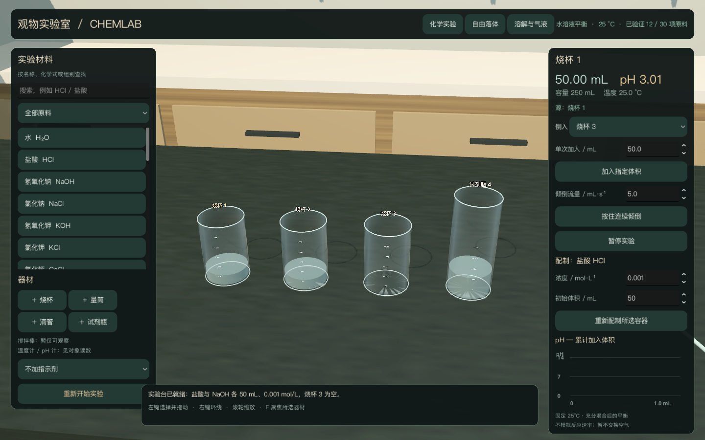
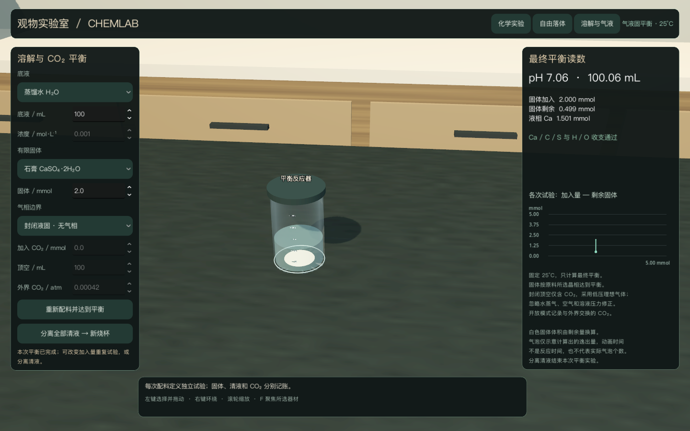

# ChemLab · 三维化学与物理实验室

Godot + C++ + IPhreeqc，中文界面。原创代码 **AGPL-3.0-only**。

项目正在按阶段开发：Phase 0 已验证，三维器材交互与基础酸碱流程已运行。
目前 **12/30 项原料**可在限定范围内加入、转移和测量；仍在开发，完整目标未完成。

用户已明确选择保留 AGPL 并从 Unreal 改为 Godot，详见
[决策记录](docs/PHASE0_DECISIONS.md)。原始目标保留于
[目标文件](docs/GOAL_OBJECTIVE.md)，其中 Unreal / 蓝图 / UMG 要求由该决定替代。

## 构建与运行（macOS Apple Silicon）

需要 CMake ≥3.20、C++17 编译器、Python 3（支持 tarfile 安全解压）、Ninja。

```sh
python3 scripts/bootstrap.py --with-godot
python3 scripts/build_catalog.py
cmake -S . -B build -G Ninja -DCMAKE_BUILD_TYPE=Release -DCMAKE_OSX_ARCHITECTURES=arm64 -DCHEMLAB_BUILD_GODOT=ON
cmake --build build --parallel 4
ctest --test-dir build --output-on-failure
tools/Godot.app/Contents/MacOS/Godot --path godot
```

也可双击 `Start ChemLab.command`。首次下载均固定版本并验证哈希，放在项目内；不全局安装。
需要 Godot 官方便携包约 163 MiB 和小型源代码依赖。

左键选择/拖动，右键环绕，滚轮缩放，F 聚焦。选择源容器、目标容器后可单次加入或按住倾倒。
默认盐酸与 NaOH 各 50 mL、0.001 mol/L；分别倒入烧杯 3 可复现中和。
原料可搜索；烧杯、量筒、滴管和试剂瓶可添加，未支持条目禁用。

## 已运行的验证与限制

- 原生 arm64 C++ 和 Godot Metal 场景启动；17 个独立 PHREEQC 状态。
- 81 组配液/分样/稀释执行（75 组不同初始配液条件）；9 项原料的界面配液、转移与读数流程。
- 等量中和、酸/碱过量、连续多次加入、空/满容器、超量及无效输入；检查电荷与元素/氢/氧守恒。
- 在实际窗口测试鼠标选择、拖动、防重叠、聚焦、重置与添加滴管。
- 固定 25°C、1–250 mL、0.00001–0.01 mol/L。以求解的溶液体积反求水质量；不把 kg 水当 L 溶液。
- HCl/NaOH/NaCl/KOH/KCl 支持限定稀溶液混合；CaCl₂/NaHCO₃/Na₂CO₃ 当前仅支持自身混合与水稀释。
- 方解石、二水石膏与 CO₂ 在独立气液固实验页支持有限加入、最终平衡、清液分离与分装；108 组条件及完整界面流程通过。
- 其余 18 项原料、更多物理实验及保存/导出尚待后续阶段。
- 自由落体已可调整高度/重力、释放、暂停、继续、重复并查看高度/速率曲线；解析碰撞时刻与固定步进已核对。
- 三种指示剂采用有来源的颜色近似，忽略微量加入影响；不模拟反应速率、热效应或空间浓度场。

[支持矩阵](docs/SUPPORT_MATRIX.md) · [科学边界](docs/VALIDATION_SCOPE.md) ·
[指示剂来源](docs/INDICATORS.md) · [进度与交接](HANDOFF.md)

[物理模型与验证](docs/PHYSICS_MODELS.md) · [气液固模型、来源与验证](docs/BATCH_EQUILIBRIUM.md)

运行 `python3 scripts/verify.py` 可执行有超时与错误日志检查的科学/渲染流程验证。





独立算例数据位于 `artifacts/iphreeqc_results.csv`；详细测试命令见交接说明。

## 许可与数据

- [AGPL-3.0](LICENSE) 适用于原创代码。
- [第三方声明](THIRD_PARTY_NOTICES.md) 保留各依赖原许可与署名。
- 数据库有覆盖不代表实验已经验证，更不代表支持任意混合。
- 尚未测得编辑器/打包程序帧率，未宣称达到 30 FPS。
