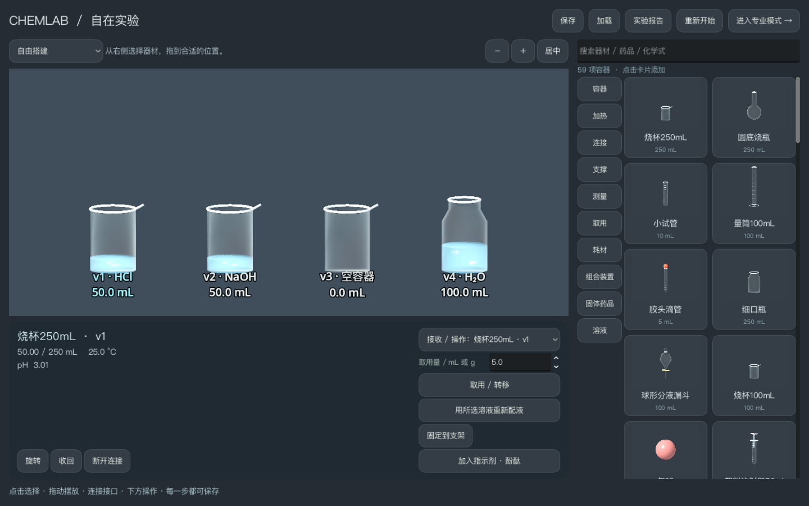
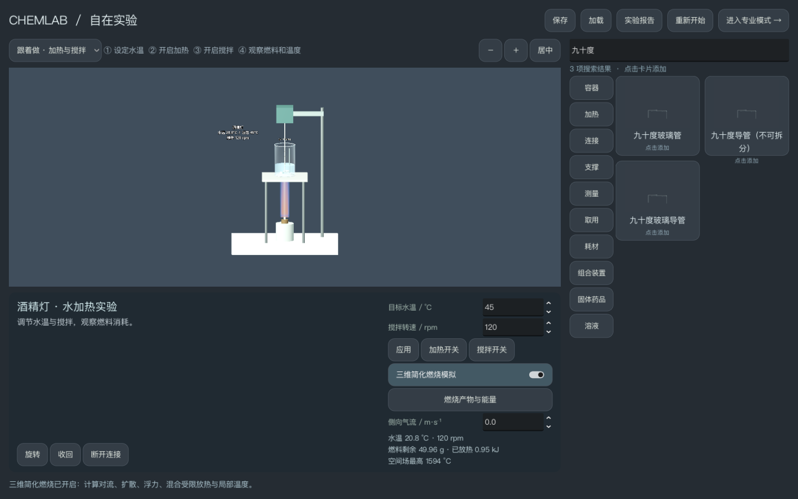

# ChemLab · 观物实验室

中文三维化学与物理实验室，使用 **Godot + C++ + IPhreeqc**，原创代码采用 **AGPL-3.0-only**。提供简洁的新手实验区和可自由观察的专业三维实验室，支持物质转移、测量、曲线、JSON 保存恢复与 CSV 导出。

## 0.2 新增内容

- **新手模式**：正面实验区、分类搜索、双列器材卡片、拖动摆放、旋转、连接、取用、称量，以及酸碱中和和加热引导。与专业模式共享水溶液状态。
- **173 项器材**：覆盖参考截图中的容器、不同容量、加热器、支架、导管、测量工具、耗材和组合装置，另含已请求的加热与搅拌设备。使用 81 种原创参数化几何族及其渲染缩略图。
- **143 个固体药品包装**：保留粉末、金属片、颗粒、水合物等包装变体。可摆放、按克从有限库存取用、在空器材间转移并称量。
- **燃烧热化学**：酒精灯、酒精喷灯、本生灯、氢氧焰和乙炔氧焰计算有限燃料消耗、供氧、产物、能量收支和理想绝热平衡温度；燃料耗尽后停止供热。
- **可独立开关的三维燃烧场**：计算粗网格速度、燃料、氧和局部温度，支持横向气流、暂停及完整保存恢复。关闭空间场后，整体燃料与热量计算继续。

器材目录和药品包装的收录**不代表所有专用功能或任意反应已经实现**。新增固体目前主要支持干态质量操作；未验证的溶解、氧化还原和制气等操作会明确提示。三维燃烧是具有守恒检查的简化教学模型，未达到详细反应动力学或工程 CFD 精度。完整范围见 [模型与近似](docs/expansion/SCIENTIFIC_MODELS.md)、[器材清单](docs/expansion/APPARATUS.md) 和 [药品包装清单](docs/expansion/MATERIALS.md)。





## 构建与启动

目前交付 macOS Apple Silicon 版本。需要 CMake ≥3.20、C++17 编译器、Ninja 和支持 tarfile 安全解压的 Python 3。

```sh
python3 scripts/bootstrap.py --with-godot
python3 scripts/build_catalog.py
python3 scripts/build_apparatus_catalog.py
python3 scripts/build_material_catalog.py
cmake -S . -B build -G Ninja -DCMAKE_BUILD_TYPE=Release -DCMAKE_OSX_ARCHITECTURES=arm64 -DCHEMLAB_BUILD_GODOT=ON
cmake --build build --parallel 4
python3 scripts/verify.py
tools/Godot.app/Contents/MacOS/Godot --path godot
```

也可双击 `Start ChemLab.command`。依赖固定版本与哈希，下载到项目内，不全局安装。Godot 编辑器便携包约 163 MiB。目录数据、原创缩略图和燃烧热化学数据已提交；正常构建不需要 Cantera 或额外生成图片。

生成独立程序：

```sh
python3 scripts/build_macos.py
open dist/ChemLab.app
```

打包脚本下载官方模板包中的 macOS 成员（约 117 MiB），验证哈希并提取 arm64 运行程序。应用约 87 MiB，内含资源、数据库、原生库和许可声明，可脱离编辑器运行。采用本地临时签名，未做 Developer ID 公证；生成的 App 不提交到 Git。

## 使用

顶部点击 **新手模式**。从右侧分类或搜索结果添加器材，点击实验区内的物品，再选择接收对象和下方操作。液体转移与重新配液是两个独立操作；配液使用界面注明的浓度和体积。一个实验最多 12 个求解器容器、60 件新手区物品和 128 条连接。

新手区顶部可选择“酸碱中和”或“加热与搅拌”。加热页可调目标水温、转速，独立开关加热、搅拌和三维燃烧场，并查看燃烧报告。目标水温与理想绝热火焰温度分别显示。

专业模式支持左键选择/拖动、右键环绕、滚轮缩放、F 聚焦。选择源和目标容器后可单次加入或按住连续倾倒；空瓶、满瓶或错误会停止。默认盐酸与 NaOH 各为 50 mL、0.001 mol/L，分别加入烧杯 3 可复现中和。顶部切换化学、气液固、沉淀和物理实验。

“保存”“加载”“导出 CSV”记录当前实验。加载后暂停；损坏或不兼容文件保留当前有效状态。本次科学模型版本升级，旧版记录会明确提示不兼容。“关于”包含协议和源代码入口。

## 科学支持范围

原有化学支持仍为 **17/30 项原料的限定实验**，与 143 个固体包装条目分别计数：

- **14 项水/预配水溶液**：H₂O、HCl、NaOH、NaCl、KOH、KCl、CaCl₂、NaHCO₃、Na₂CO₃、H₂SO₄、Na₂SO₄、MgCl₂、MgSO₄、BaCl₂。25°C、初始 1–250 mL、0.00001–0.01 mol/L；混合白名单见 [支持矩阵](docs/SUPPORT_MATRIX.md)。
- **3 项独立气液固原料**：CO₂、CaCO₃（Calcite）、CaSO₄·2H₂O（Gypsum），包含有限加料、开放/封闭气相、最终平衡、清液分离和分装。
- **Barite 沉淀**：BaCl₂ + Na₂SO₄ 的未饱和、过量和析出量由平衡求解得到。
- **七类物理实验**：自由落体、弹簧、单摆、热交换、直流电路、薄透镜、加热与搅拌，提供参数、固定模拟步、暂停/重复及曲线。
- **独立燃烧模型**：常压理想气体 Gibbs 平衡，采用单套 NASA7 热化学数据；液态乙醇包含汽化焓修正。水吸热使用明确的固定捕获比例，三维场采用经验单步反应和粗网格流动近似。

水溶液仍为固定 25°C、充分混合后的平衡，不计算任意反应速率、氧化还原、有机合成或反应放热。燃烧模块独立于 PHREEQC 水溶液实验；不会把高温火焰读数当作烧杯化学温度。玻璃、液体和部分器材外观为经过体积核对的视觉近似，未经实物光学标定。

## 验证

`python3 scripts/verify.py` 执行 9 项原生科学测试、Godot 导入和 11 个界面/保存流程（2 个无窗口、9 个真实渲染流程）。燃烧测试包含 20 组独立 Cantera 平衡参考、有限燃料耗尽、能量与元素收支；空间场测试包括点燃/停料冷却、30/60 FPS 一致性及完整快照恢复。新手流程检查目录搜索、液体转移、有限固体质量、连接、模式切换和保存恢复。

此前完整扩展验证与保存修复的定向回归结果见 [扩展验证记录](artifacts/expansion-validation.json)。最终完整复测在物理流程未收到通过标记后停止；性能首测未通过，编辑器复测中断。遵照用户停止重复测试的要求，未继续重跑，**最终版不声明全套测试或全场景 30 FPS 已通过**。原始结果见 [最近测试记录](artifacts/verification.json) 和 [性能报告](docs/PERFORMANCE.md)。性能以 P99 帧间隔和最低完整秒帧数核对，记录最长帧与系统内存；不把无窗口测试计为帧率，也不沿用旧版性能结论。

```sh
python3 scripts/benchmark.py --phase-seconds 6 --stress-seconds 30
python3 scripts/benchmark.py --packaged --phase-seconds 6 --stress-seconds 30
```

[科学边界](docs/VALIDATION_SCOPE.md) · [气液固](docs/BATCH_EQUILIBRIUM.md) · [沉淀](docs/PRECIPITATION.md) · [物理模型](docs/PHYSICS_MODELS.md) · [加热与搅拌](docs/HEATING_AND_STIRRING.md) · [指示剂](docs/INDICATORS.md) · [保存/CSV](docs/SESSION_FORMAT.md) · [打包](docs/PACKAGING.md) · [交付状态](docs/DELIVERY_STATUS.md) · [交接](HANDOFF.md)

## 许可与来源

[AGPL-3.0](LICENSE) 适用于原创代码；[第三方声明](THIRD_PARTY_NOTICES.md) 保留 Godot、godot-cpp、IPhreeqc、Cantera 数据及其他组件的原许可。PHREEQC 数据库原始字节未修改，未拼接其他水溶液数据库；燃烧数据独立记录来源、版本与校验值。参考截图用于确认器材目录和界面方向，未复制其他产品的图像、标志或付费资源。

用户批准的 Godot、AGPL 与公开仓库决策见 [决策记录](docs/PHASE0_DECISIONS.md)；本次需求见 [扩展记录](docs/expansion/REQUEST.md)。
