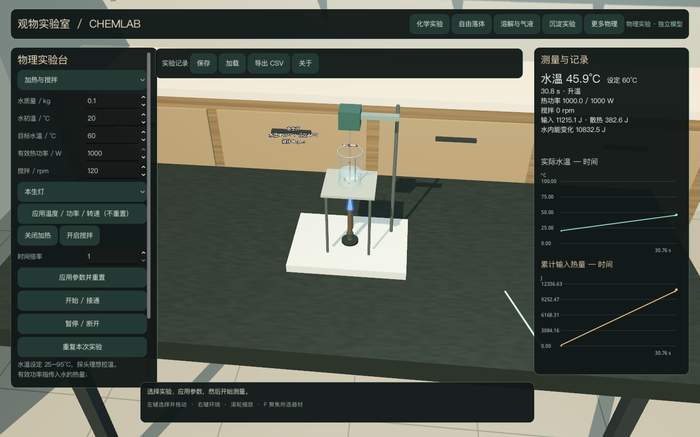
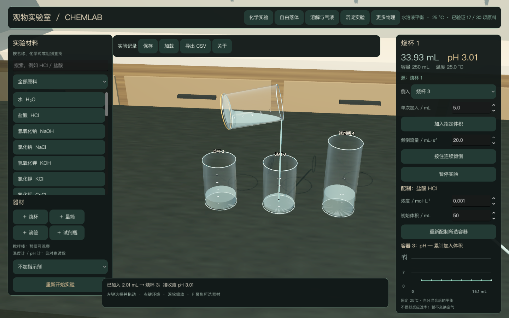

# ChemLab · 观物实验室

中文三维化学与物理实验室，使用 **Godot + C++ + IPhreeqc**，原创代码采用 **AGPL-3.0-only**。

目前支持 **17/30 项原料**的限定实验，以及自由落体、弹簧、单摆、热交换、直流电路、薄透镜和加热搅拌。支持器材操作、实际物质转移、测量/曲线、JSON 保存恢复和 CSV 导出。另 13 项显示“尚未支持”，不计入可操作数量，也不承诺任意混合。

已在 M4 / 16 GiB、实际 1920×1080 图像下通过编辑器及独立程序的 30 FPS 性能判据，并完成约十分钟、193 轮重复操作验证。详见 [实测报告](docs/PERFORMANCE.md)。

用户已批准保留 AGPL、从 Unreal 改用 Godot，并公开此仓库。见 [决策记录](docs/PHASE0_DECISIONS.md) 和 [原始目标](docs/GOAL_OBJECTIVE.md)。

## 构建与启动

macOS Apple Silicon；需要 CMake ≥3.20、C++17 编译器、Ninja、支持 tarfile 安全解压的 Python 3。

```sh
python3 scripts/bootstrap.py --with-godot
python3 scripts/build_catalog.py
cmake -S . -B build -G Ninja -DCMAKE_BUILD_TYPE=Release -DCMAKE_OSX_ARCHITECTURES=arm64 -DCHEMLAB_BUILD_GODOT=ON
cmake --build build --parallel 4
python3 scripts/verify.py
tools/Godot.app/Contents/MacOS/Godot --path godot
```

构建后也可双击 `Start ChemLab.command`。依赖固定版本、校验哈希，下载到项目内，不全局安装。Godot 编辑器便携包约 163 MiB。

生成独立程序：

```sh
python3 scripts/build_macos.py
open dist/ChemLab.app
```

打包脚本只下载官方模板包中的 macOS 成员（约 117 MiB），验证哈希，并提取 arm64 运行程序。应用内含资源、数据库、原生库和第三方声明，不依赖编辑器安装。采用本地临时签名，未做 Apple Developer ID 公证；当前只交付 Apple Silicon 版本。

## 操作

左键选择/拖动、右键环绕、滚轮缩放、F 聚焦。选择源和目标容器后可单次加入或按住连续倾倒；空瓶、满瓶或错误会停止。默认盐酸与 NaOH 各为 50 mL、0.001 mol/L，分别加入烧杯 3 可复现中和。

顶部切换化学/气液固/沉淀/物理实验；原料按名称、化学式或类别搜索。可添加烧杯、量筒、滴管、试剂瓶。化学台搅拌棒仅供观察；「物理实验 → 加热与搅拌」提供可启停、调速的电动搅拌桨，以及可调目标水温的电热板、酒精灯、本生灯、氢氧焰、乙炔氧焰和酒精喷灯。pH/温度计是模型读数，未开放的操作有说明。

“保存”“加载”“导出 CSV”位于顶部实验记录栏。加载后全部暂停，继续/重复按钮可继续运行；损坏或不兼容文件保留当前有效状态。“关于”可查看协议和源代码入口。

## 已验证范围

- 原生 arm64 IPhreeqc：纯水、稀强酸碱、配液的 mL/mol/L 换算、分样/稀释、过量/反复加入、电荷、元素与氢/氧守恒。
- **14 项水/预配水溶液**：H₂O、HCl、NaOH、NaCl、KOH、KCl、CaCl₂、NaHCO₃、Na₂CO₃、H₂SO₄、Na₂SO₄、MgCl₂、MgSO₄、BaCl₂。25°C、初始 1–250 mL、0.00001–0.01 mol/L；具体混合白名单见支持矩阵。
- **3 项独立气液固原料**：CO₂、CaCO₃（Calcite）、CaSO₄·2H₂O（Gypsum）。有限加料、开放/封闭气相、最终平衡、清液分离和分装，分别核对溶液/气相/固相收支。
- BaCl₂ + Na₂SO₄ 的 **Barite 沉淀实验**，包含未饱和、过量和析出量验证；不由试剂名称直接触发沉淀动画。
- 七类物理模型有参数、解析核对、固定模拟步、暂停/重复、三维状态与曲线。热量单独记账。
- 加热与搅拌支持运行中调温/调速、独立开关、恒温与自然冷却，记录控制历史和能量收支。六种热源按指定有效功率传热；不模拟燃烧或真实火焰温度。
- 三种指示剂使用有来源的 pH—颜色近似，忽略微量加入对体系的影响；已核对变色范围端点。
- 实际渲染流程覆盖按钮、选择/拖动/防重叠、倾倒/停止、相平衡、七类物理实验、保存恢复、CSV 和错误保留。`artifacts/verification.json` 是最近一次完整验证记录。

化学采用固定 25°C、充分混合后的平衡，不模拟反应速率、燃烧、有机合成、任意氧化还原、反应放热或空间浓度场。均一分样保持强度量，真正混合再求平衡。液体、玻璃与部分教学器材是明确的视觉近似，未声称经过实物光学标定。

[支持矩阵](docs/SUPPORT_MATRIX.md) · [科学边界](docs/VALIDATION_SCOPE.md) · [气液固](docs/BATCH_EQUILIBRIUM.md) · [扩展溶液](docs/AQUEOUS_EXTENSION.md) · [沉淀](docs/PRECIPITATION.md) · [物理模型](docs/PHYSICS_MODELS.md) · [加热与搅拌](docs/HEATING_AND_STIRRING.md) · [指示剂](docs/INDICATORS.md) · [保存/CSV](docs/SESSION_FORMAT.md) · [视觉验证](docs/VISUAL_MODEL.md) · [打包](docs/PACKAGING.md) · [性能](docs/PERFORMANCE.md) · [交付状态](docs/DELIVERY_STATUS.md) · [交接](HANDOFF.md)






## 许可

[AGPL-3.0](LICENSE) 适用于原创代码；[第三方声明](THIRD_PARTY_NOTICES.md) 保留 Godot、godot-cpp、IPhreeqc、数据库及其他组件原许可。数据库原始字节未修改，未拼接其他热力学数据库。
